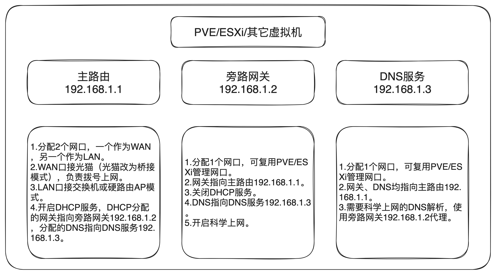

# ImageBuilder-ImmortalWrt
基于 ImageBuilder 定制的 ImmortalWrt 旁路网关。组件大量精简，仅适合虚拟机安装（精简了实体网卡驱动）。

# 旁路网关


# 定制内容
## 精简
本着够用原则，非必要组件全部精简。
1. 精简 f2fs 磁盘驱动、mount 挂载相关组件。
2. 精简全部音频设备驱动、音频播放组件。
3. 精简全部实体卡驱动。仅保留 e1000、e1000e、vmxnet3 虚拟网卡驱动，仅适合虚拟机安装。
4. 精简全部 usb 相关组件。
5. 精简全部 pppoe 相关组件。旁路网关不负责拨号。
6. 精简全部 ipv6 相关组件。

## 添加
所有新增组件，均来自 ImmortalWrt 官方。
1. 添加 argon 主题。
2. 添加定时重启。
3. 添加 passwall。
4. 补全页面中文翻译。

# 安装
注意：
1. 由于精简了实体网卡驱动，仅支持虚拟机安装。
2. 作为旁路网关，仅需分配一张网卡用作 LAN 口即可。

## 虚拟机安装
推荐使用 PVE LXC 容器安装，占用资源极少。

### PVE LXC 容器安装方式
WEB 页面无法直接创建 OpenWrt LXC 容器，此处需要使用 shell 命令进行创建。
1. 上传 `immortalwrt-X.X.X-x86-64-generic-rootfs.tar.gz` 文件至 PVE `/var/lib/vz/template/cache` 目录。
2. 使用 shell 命令创建 LXC 容器
    ```bash
    pct create 100 \
        local:vztmpl/immortalwrt-X.X.X-x86-64-generic-rootfs.tar.gz \
        --rootfs local-lvm:2 \
        --ostype unmanaged \
        --hostname OpenWrt \
        --arch amd64 \
        --cores 4 \
        --memory 2048 \
        --swap 0 \
        -net0 bridge=vmbr0,name=eth0
    ```
    参数说明：
    ```bash
    100		
        容器编号，请根据实际情况设置。
    local:vztmpl/immortalwrt-X.X.X-x86-64-generic-rootfs.tar.gz	
        容器模板，local:vztmpl 指向 /var/lib/vz/template/cache 目录，是 PVE 默认 CT 模板存放目录。immortalwrt-X.X.X-x86-64-generic-rootfs.tar.gz 为待安装文件。
    rootfs local-lvm:2
        根磁盘位置，local-lvm 可以根据实际情况修改为其他存储位置，2 表示磁盘大小为 2G。
    ostype unmanaged
        系统类型。
    hostname ImmortalWrt
        容器名称。
    arch amd64
        系统架构，amd64。
    cores 4
        分配给容器的 CPU 核心数。
    memory 2048
        分配给容器的内存大小，这里是 2G。
    swap 0
        分配给容器的交换区大小，建议设置为 0。
    net0 bridge=vmbr0,name=eth0
        容器网络设置，为容器中增加网卡 eth0 ，桥接到主机的 vmbr0 网卡。
    ```
3. 修改 LXC 容器配置文件 `/etc/pve/lxc/100.conf`（100 为以上创建容器时的容器编号），在文末增加三行：
    ```bash
    onboot: 1
    features: fuse=1,nesting=1
    lxc.include: /usr/share/lxc/config/openwrt.common.conf
    ```
    参数说明：
    ```bash
    onboot: 1
        开机自启动。
    features: fuse=1,nesting=1
        特权容器，允许嵌套。
    lxc.include: /usr/share/lxc/config/openwrt.common.conf
        引用 PVE 自带的 OpenWrt 配置。
    ```

### 其它虚拟机安装方式
此处不再赘述。

## 配置
1. 默认账号 `root`，密码 `password`。
2. 默认 LAN 口 IP 为 `192.168.1.5`。通过 `/etc/config/network` 修改，修改后需重启。
3. LAN 口网关修改为主路由 IP 地址。
4. LAN 口 DNS 修改为主路由 IP 地址。作为旁路网关，DNS 服务仅包含 dnsmasq，未打包 AdGuardHome、MosDNS、SmartDNS 等高级 DNS 服务。如有需求，建议单独部署高级 DNS 服务，将旁路网关的 DNS 指过去即可。可参考 [NestingDNS](https://github.com/217heidai/NestingDNS)，一款尝试 AdGuardHome、MosDNS、SmartDNS 套娃使用最佳实践的 DNS 服务。
5. 作为旁路网关，LAN 口 DHCP 默认已关闭，需主路由进行 DHCP。（如开启 DHCP 服务，则变为旁路路由模式）